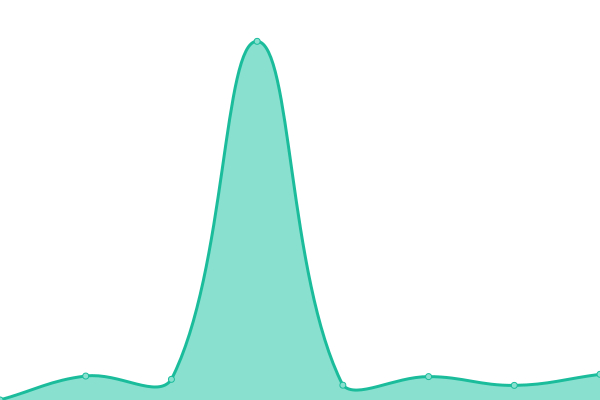
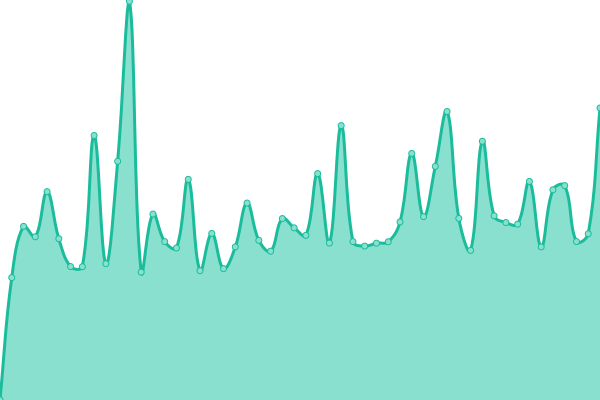
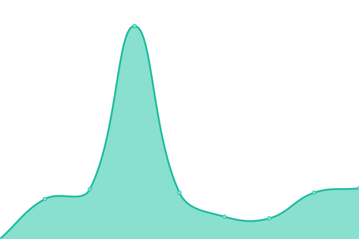
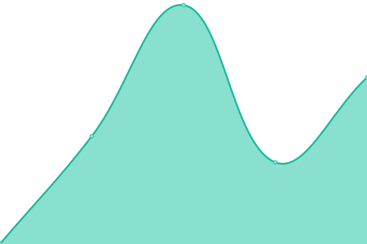
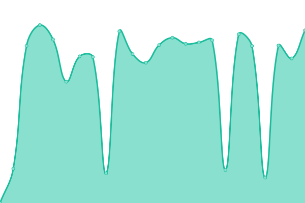

# [📈 Live Status](https://https://iliya5digital.github.io/): <!--live status--> **🟧 Partial outage**

This repository contains the open-source uptime monitor and status page for [iliya5digital](https://https://iliya5digital.github.io/), powered by [Upptime](https://github.com/upptime/upptime).

With [Upptime](https://upptime.js.org), you can get your own unlimited and free uptime monitor and status page, powered entirely by a GitHub repository. We use [Issues](https://github.com/iliya5digital/uptime/issues) as incident reports, [Actions](https://github.com/iliya5digital/uptime/actions) as uptime monitors, and [Pages](https://https://iliya5digital.github.io/) for the status page.

<!--start: status pages-->
<!-- This summary is generated by Upptime (https://github.com/upptime/upptime) -->
<!-- Do not edit this manually, your changes will be overwritten -->
<!-- prettier-ignore -->
| URL | Status | History | Response Time | Uptime |
| --- | ------ | ------- | ------------- | ------ |
|  [FK](https://fk.by) | 🟩 Up | [fk.yml](https://github.com/Iliya5digital/uptime/commits/HEAD/history/fk.yml) | 

 1242ms
     
 | 

<a href="https://iliya5digital.github.io/uptime/history/fk">100.00%</a>
    

|  [MultiGame](https://multigame.by) | 🟩 Up | [multi-game.yml](https://github.com/Iliya5digital/uptime/commits/HEAD/history/multi-game.yml) | 

 1063ms
     
 | 

<a href="https://iliya5digital.github.io/uptime/history/multi-game">100.00%</a>
    

|  [dcompany](https://dcompany.by) | 🟩 Up | [dcompany.yml](https://github.com/Iliya5digital/uptime/commits/HEAD/history/dcompany.yml) | 

 1338ms
     
 | 

<a href="https://iliya5digital.github.io/uptime/history/dcompany">100.00%</a>
    

|  [Microsoft](https://microsoft.com) | 🟩 Up | [microsoft.yml](https://github.com/Iliya5digital/uptime/commits/HEAD/history/microsoft.yml) | 

 835ms
     
 | 

<a href="https://iliya5digital.github.io/uptime/history/microsoft">100.00%</a>
    

|  [newblue](https://www.newbluefx.com) | 🟩 Up | [newblue.yml](https://github.com/Iliya5digital/uptime/commits/HEAD/history/newblue.yml) | 

 637ms
     
 | 

<a href="https://iliya5digital.github.io/uptime/history/newblue">100.00%</a>
    

|  [dmyt](https://dmyt.ru) | 🟩 Up | [dmyt.yml](https://github.com/Iliya5digital/uptime/commits/HEAD/history/dmyt.yml) | 

 1458ms
     
 | 

<a href="https://iliya5digital.github.io/uptime/history/dmyt">100.00%</a>
    

|  [mybb](http://mybb.ru) | 🟩 Up | [mybb.yml](https://github.com/Iliya5digital/uptime/commits/HEAD/history/mybb.yml) | 

 636ms
     
 | 

<a href="https://iliya5digital.github.io/uptime/history/mybb">100.00%</a>
    

|  [21vek](https://21vek.by) | 🟩 Up | [21vek.yml](https://github.com/Iliya5digital/uptime/commits/HEAD/history/21vek.yml) | 

 4223ms
     
 | 

<a href="https://iliya5digital.github.io/uptime/history/21vek">100.00%</a>
    

|  [ISONCOM](https://isoncom.ru) | 🟩 Up | [isoncom.yml](https://github.com/Iliya5digital/uptime/commits/HEAD/history/isoncom.yml) | 

 3711ms
     
 | 

<a href="https://iliya5digital.github.io/uptime/history/isoncom">100.00%</a>
    

|  [kunegin](http://kunegin.com) | 🟩 Up | [kunegin.yml](https://github.com/Iliya5digital/uptime/commits/HEAD/history/kunegin.yml) | 

 991ms
     
 | 

<a href="https://iliya5digital.github.io/uptime/history/kunegin">100.00%</a>
    

|  [directmusic](https://directmusic.me) | 🟩 Up | [directmusic.yml](https://github.com/Iliya5digital/uptime/commits/HEAD/history/directmusic.yml) | 

 408ms
     
 | 

<a href="https://iliya5digital.github.io/uptime/history/directmusic">100.00%</a>
    

|  [knowyourmobile](https://www.knowyourmobile.com/) | 🟩 Up | [knowyourmobile.yml](https://github.com/Iliya5digital/uptime/commits/HEAD/history/knowyourmobile.yml) | 

 391ms
     
 | 

<a href="https://iliya5digital.github.io/uptime/history/knowyourmobile">100.00%</a>
    

|  [ohrana UA - охранные системы](https://ohrana.ua/) | 🟩 Up | [ohrana-ua-ohrannye-sistemy.yml](https://github.com/Iliya5digital/uptime/commits/HEAD/history/ohrana-ua-ohrannye-sistemy.yml) | 

 2201ms
     
 | 

<a href="https://iliya5digital.github.io/uptime/history/ohrana-ua-ohrannye-sistemy">100.00%</a>
    

|  [zaberem](https://zaberem.by) | 🟩 Up | [zaberem.yml](https://github.com/Iliya5digital/uptime/commits/HEAD/history/zaberem.yml) | 

 1295ms
     
 | 

<a href="https://iliya5digital.github.io/uptime/history/zaberem">76.74%</a>
    

|  [Xiaomi](https://mi.com) | 🟩 Up | [xiaomi.yml](https://github.com/Iliya5digital/uptime/commits/HEAD/history/xiaomi.yml) | 

 2463ms
     
 | 

<a href="https://iliya5digital.github.io/uptime/history/xiaomi">100.00%</a>
    

|  [wplovers](https://wplovers.pw) | 🟩 Up | [wplovers.yml](https://github.com/Iliya5digital/uptime/commits/HEAD/history/wplovers.yml) | 

 2608ms
     
 | 

<a href="https://iliya5digital.github.io/uptime/history/wplovers">100.00%</a>
    

|  [WINITPRO](https://winitpro.ru) | 🟩 Up | [winitpro.yml](https://github.com/Iliya5digital/uptime/commits/HEAD/history/winitpro.yml) | 

 1316ms
     
 | 

<a href="https://iliya5digital.github.io/uptime/history/winitpro">100.00%</a>
    

|  [wdfiles](https://wdfiles.ru) | 🟩 Up | [wdfiles.yml](https://github.com/Iliya5digital/uptime/commits/HEAD/history/wdfiles.yml) | 

 1874ms
     
 | 

<a href="https://iliya5digital.github.io/uptime/history/wdfiles">100.00%</a>
    

|  [wapinet](https://wapinet.ru) | 🟩 Up | [wapinet.yml](https://github.com/Iliya5digital/uptime/commits/HEAD/history/wapinet.yml) | 

 847ms
     
 | 

<a href="https://iliya5digital.github.io/uptime/history/wapinet">100.00%</a>
    

|  [vpngate](https://www.vpngate.net) | 🟩 Up | [vpngate.yml](https://github.com/Iliya5digital/uptime/commits/HEAD/history/vpngate.yml) | 

 2111ms
     
 | 

<a href="https://iliya5digital.github.io/uptime/history/vpngate">99.80%</a>
    

|  [ugonanet](https://www.ugona.net) | 🟩 Up | [ugonanet.yml](https://github.com/Iliya5digital/uptime/commits/HEAD/history/ugonanet.yml) | 

 1211ms
     
 | 

<a href="https://iliya5digital.github.io/uptime/history/ugonanet">100.00%</a>
    

|  [text-host](http://text-host.ru) | 🟩 Up | [text-host.yml](https://github.com/Iliya5digital/uptime/commits/HEAD/history/text-host.yml) | 

 1723ms
     
 | 

<a href="https://iliya5digital.github.io/uptime/history/text-host">100.00%</a>
    

|  [spaces](https://spcs.mobi) | 🟩 Up | [spaces.yml](https://github.com/Iliya5digital/uptime/commits/HEAD/history/spaces.yml) | 

 1367ms
     
 | 

<a href="https://iliya5digital.github.io/uptime/history/spaces">99.73%</a>
    

|  [shopby](https://shop.by) | 🟩 Up | [shopby.yml](https://github.com/Iliya5digital/uptime/commits/HEAD/history/shopby.yml) | 

 3020ms
     
 | 

<a href="https://iliya5digital.github.io/uptime/history/shopby">100.00%</a>
    

|  [rutracker](https://rutracker.org) | 🟥 Down | [rutracker.yml](https://github.com/Iliya5digital/uptime/commits/HEAD/history/rutracker.yml) | 

 112ms
     
 | 

<a href="https://iliya5digital.github.io/uptime/history/rutracker">0.00%</a>
    

|  [rutor](http://rutor.info) | 🟩 Up | [rutor.yml](https://github.com/Iliya5digital/uptime/commits/HEAD/history/rutor.yml) | 

 860ms
     
 | 

<a href="https://iliya5digital.github.io/uptime/history/rutor">100.00%</a>
    

|  [reg](https://www.reg.ru) | 🟥 Down | [reg.yml](https://github.com/Iliya5digital/uptime/commits/HEAD/history/reg.yml) | 

 1233ms
     
 | 

<a href="https://iliya5digital.github.io/uptime/history/reg">33.08%</a>
    

|  [ram](https://ram.by) | 🟩 Up | [ram.yml](https://github.com/Iliya5digital/uptime/commits/HEAD/history/ram.yml) | 

 1737ms
     
 | 

<a href="https://iliya5digital.github.io/uptime/history/ram">100.00%</a>
    

|  [prossd](https://prossd.ru) | 🟩 Up | [prossd.yml](https://github.com/Iliya5digital/uptime/commits/HEAD/history/prossd.yml) | 

 3073ms
     
 | 

<a href="https://iliya5digital.github.io/uptime/history/prossd">100.00%</a>
    

|  [prog-top](https://prog-top.net) | 🟩 Up | [prog-top.yml](https://github.com/Iliya5digital/uptime/commits/HEAD/history/prog-top.yml) | 

 4340ms
     
 | 

<a href="https://iliya5digital.github.io/uptime/history/prog-top">100.00%</a>
    

|  [obmenvsem](https://obmenvsem.org) | 🟩 Up | [obmenvsem.yml](https://github.com/Iliya5digital/uptime/commits/HEAD/history/obmenvsem.yml) | 

 862ms
     
 | 

<a href="https://iliya5digital.github.io/uptime/history/obmenvsem">99.19%</a>
    

|  [notopening](https://notopening.com) | 🟩 Up | [notopening.yml](https://github.com/Iliya5digital/uptime/commits/HEAD/history/notopening.yml) | 

 550ms
     
 | 

<a href="https://iliya5digital.github.io/uptime/history/notopening">100.00%</a>
    

|  [notebook31](https://notebook-31.ru) | 🟩 Up | [notebook31.yml](https://github.com/Iliya5digital/uptime/commits/HEAD/history/notebook31.yml) | 

 1044ms
     
 | 

<a href="https://iliya5digital.github.io/uptime/history/notebook31">100.00%</a>
    

|  [mega](https://mega.nz) | 🟩 Up | [mega.yml](https://github.com/Iliya5digital/uptime/commits/HEAD/history/mega.yml) | 

 571ms
     
 | 

<a href="https://iliya5digital.github.io/uptime/history/mega">100.00%</a>
    

|  [mediafire](https://mediafire.com) | 🟩 Up | [mediafire.yml](https://github.com/Iliya5digital/uptime/commits/HEAD/history/mediafire.yml) | 

 522ms
     
 | 

<a href="https://iliya5digital.github.io/uptime/history/mediafire">100.00%</a>
    

|  [malwarewatch](https://malwarewatch.org) | 🟩 Up | [malwarewatch.yml](https://github.com/Iliya5digital/uptime/commits/HEAD/history/malwarewatch.yml) | 

 483ms
     
 | 

<a href="https://iliya5digital.github.io/uptime/history/malwarewatch">56.39%</a>
    

|  [mchost](https://mchost.ru) | 🟩 Up | [mchost.yml](https://github.com/Iliya5digital/uptime/commits/HEAD/history/mchost.yml) | 

 1176ms
     
 | 

<a href="https://iliya5digital.github.io/uptime/history/mchost">100.00%</a>
    

|  [kichkaz](https://kichkas.biz) | 🟩 Up | [kichkaz.yml](https://github.com/Iliya5digital/uptime/commits/HEAD/history/kichkaz.yml) | 

 1416ms
     
 | 

<a href="https://iliya5digital.github.io/uptime/history/kichkaz">100.00%</a>
    

|  [ipxe](https://ipxe.org) | 🟩 Up | [ipxe.yml](https://github.com/Iliya5digital/uptime/commits/HEAD/history/ipxe.yml) | 

 589ms
     
 | 

<a href="https://iliya5digital.github.io/uptime/history/ipxe">100.00%</a>
    

|  [imgdb](https://imgdb.net) | 🟩 Up | [imgdb.yml](https://github.com/Iliya5digital/uptime/commits/HEAD/history/imgdb.yml) | 

 713ms
     
 | 

<a href="https://iliya5digital.github.io/uptime/history/imgdb">100.00%</a>
    

|  [archive](https://archive.org) | 🟩 Up | [archive.yml](https://github.com/Iliya5digital/uptime/commits/HEAD/history/archive.yml) | 

 283ms
     
 | 

<a href="https://iliya5digital.github.io/uptime/history/archive">100.00%</a>
    

|  [HYPERPC](https://hyperpc.ru) | 🟩 Up | [hyperpc.yml](https://github.com/Iliya5digital/uptime/commits/HEAD/history/hyperpc.yml) | 

 1395ms
     
 | 

<a href="https://iliya5digital.github.io/uptime/history/hyperpc">100.00%</a>
    

|  [hostfly](https://www.hostfly.by) | 🟩 Up | [hostfly.yml](https://github.com/Iliya5digital/uptime/commits/HEAD/history/hostfly.yml) | 

 1457ms
     
 | 

<a href="https://iliya5digital.github.io/uptime/history/hostfly">100.00%</a>
    

|  [hosterby](https://hoster.by) | 🟩 Up | [hosterby.yml](https://github.com/Iliya5digital/uptime/commits/HEAD/history/hosterby.yml) | 

 13818ms
     
 | 

<a href="https://iliya5digital.github.io/uptime/history/hosterby">100.00%</a>
    

|  [helpwifi](https://help-wifi.com) | 🟩 Up | [helpwifi.yml](https://github.com/Iliya5digital/uptime/commits/HEAD/history/helpwifi.yml) | 

 3274ms
     
 | 

<a href="https://iliya5digital.github.io/uptime/history/helpwifi">100.00%</a>
    

|  [fex](https://fex.net) | 🟩 Up | [fex.yml](https://github.com/Iliya5digital/uptime/commits/HEAD/history/fex.yml) | 

 851ms
     
 | 

<a href="https://iliya5digital.github.io/uptime/history/fex">100.00%</a>
    

|  [evozi](https://evozi.com) | 🟩 Up | [evozi.yml](https://github.com/Iliya5digital/uptime/commits/HEAD/history/evozi.yml) | 

 1079ms
     
 | 

<a href="https://iliya5digital.github.io/uptime/history/evozi">100.00%</a>
    

|  [E2](https://e2.by) | 🟩 Up | [e2.yml](https://github.com/Iliya5digital/uptime/commits/HEAD/history/e2.yml) | 

 3676ms
     
 | 

<a href="https://iliya5digital.github.io/uptime/history/e2">100.00%</a>
    

|  [domaintools](https://www.domaintools.com) | 🟩 Up | [domaintools.yml](https://github.com/Iliya5digital/uptime/commits/HEAD/history/domaintools.yml) | 

 279ms
     
 | 

<a href="https://iliya5digital.github.io/uptime/history/domaintools">100.00%</a>
    

|  [DataPro](https://datapro.ru) | 🟩 Up | [data-pro.yml](https://github.com/Iliya5digital/uptime/commits/HEAD/history/data-pro.yml) | 

 2460ms
     
 | 

<a href="https://iliya5digital.github.io/uptime/history/data-pro">100.00%</a>
    

|  [anonfiles](https://anonfiles.com) | 🟩 Up | [anonfiles.yml](https://github.com/Iliya5digital/uptime/commits/HEAD/history/anonfiles.yml) | 

 847ms
     
 | 

<a href="https://iliya5digital.github.io/uptime/history/anonfiles">100.00%</a>
    

|  [amd shop](https://www.amd.by/) | 🟥 Down | [amd-shop.yml](https://github.com/Iliya5digital/uptime/commits/HEAD/history/amd-shop.yml) | 

 137ms
     
 | 

<a href="https://iliya5digital.github.io/uptime/history/amd-shop">0.00%</a>
    

|  [adguard](https://adguard.com) | 🟩 Up | [adguard.yml](https://github.com/Iliya5digital/uptime/commits/HEAD/history/adguard.yml) | 

 1433ms
     
 | 

<a href="https://iliya5digital.github.io/uptime/history/adguard">100.00%</a>
    

|  [5digital](https://5digital.by) | 🟩 Up | [5digital.yml](https://github.com/Iliya5digital/uptime/commits/HEAD/history/5digital.yml) | 

 4774ms
     
 | 

<a href="https://iliya5digital.github.io/uptime/history/5digital">98.98%</a>
    

|  [4shared](https://4shared.com) | 🟩 Up | [4shared.yml](https://github.com/Iliya5digital/uptime/commits/HEAD/history/4shared.yml) | 

 616ms
     
 | 

<a href="https://iliya5digital.github.io/uptime/history/4shared">100.00%</a>
    

|  [4pda](https://4pda.to) | 🟩 Up | [4pda.yml](https://github.com/Iliya5digital/uptime/commits/HEAD/history/4pda.yml) | 

 434ms
     
 | 

<a href="https://iliya5digital.github.io/uptime/history/4pda">100.00%</a>
    

|  [4pc](https://www.4pc.by) | 🟩 Up | [4pc.yml](https://github.com/Iliya5digital/uptime/commits/HEAD/history/4pc.yml) | 

 2027ms
     
 | 

<a href="https://iliya5digital.github.io/uptime/history/4pc">100.00%</a>
    

|  [dry](https://dry.by/) | 🟩 Up | [dry.yml](https://github.com/Iliya5digital/uptime/commits/HEAD/history/dry.yml) | 

 2292ms
     
 | 

<a href="https://iliya5digital.github.io/uptime/history/dry">100.00%</a>
    

|  [listoffreeware](https://listoffreeware.com/) | 🟩 Up | [listoffreeware.yml](https://github.com/Iliya5digital/uptime/commits/HEAD/history/listoffreeware.yml) | 

 210ms
     
 | 

<a href="https://iliya5digital.github.io/uptime/history/listoffreeware">100.00%</a>
    

|  [Windowsnotes](https://windowsnotes.ru) | 🟩 Up | [windowsnotes.yml](https://github.com/Iliya5digital/uptime/commits/HEAD/history/windowsnotes.yml) | 

 1972ms
     
 | 

<a href="https://iliya5digital.github.io/uptime/history/windowsnotes">100.00%</a>
    

|  [Издательство «Открытые системы»](https://www.osp.ru) | 🟥 Down | [izdatelstvo-otkrytye-sistemy.yml](https://github.com/Iliya5digital/uptime/commits/HEAD/history/izdatelstvo-otkrytye-sistemy.yml) | 

 3508ms
     
 | 

<a href="https://iliya5digital.github.io/uptime/history/izdatelstvo-otkrytye-sistemy">37.75%</a>
    

|  [форум xenforo](https://xenforo.info) | 🟩 Up | [forum-xenforo.yml](https://github.com/Iliya5digital/uptime/commits/HEAD/history/forum-xenforo.yml) | 

 991ms
     
 | 

<a href="https://iliya5digital.github.io/uptime/history/forum-xenforo">100.00%</a>
    

|  [old-games](https://www.old-games.ru) | 🟩 Up | [old-games.yml](https://github.com/Iliya5digital/uptime/commits/HEAD/history/old-games.yml) | 

 1729ms
     
 | 

<a href="https://iliya5digital.github.io/uptime/history/old-games">100.00%</a>
    

|  [g-ek](https://g-ek.com) | 🟩 Up | [g-ek.yml](https://github.com/Iliya5digital/uptime/commits/HEAD/history/g-ek.yml) | 

 932ms
     
 | 

<a href="https://iliya5digital.github.io/uptime/history/g-ek">98.31%</a>
    

|  [simplight](https://simplight.ru) | 🟩 Up | [simplight.yml](https://github.com/Iliya5digital/uptime/commits/HEAD/history/simplight.yml) | 

 5691ms
     
 | 

<a href="https://iliya5digital.github.io/uptime/history/simplight">100.00%</a>
    

|  [s-terra](https://s-terra.ru) | 🟩 Up | [s-terra.yml](https://github.com/Iliya5digital/uptime/commits/HEAD/history/s-terra.yml) | 

 3884ms
     
 | 

<a href="https://iliya5digital.github.io/uptime/history/s-terra">100.00%</a>
    

|  [networkguru](https://networkguru.ru) | 🟩 Up | [networkguru.yml](https://github.com/Iliya5digital/uptime/commits/HEAD/history/networkguru.yml) | 

 1444ms
     
 | 

<a href="https://iliya5digital.github.io/uptime/history/networkguru">100.00%</a>
    

|  [Windows 햢햩혪 혜햦혜혝햣햪햫혦혠 햟햢햪햦햫햦혜혝햟혝쮐쮏쑇(https://winitpro.ru) | 🟩 Up | [windows-dlya-sistemnyh-administratorov.yml](https://github.com/Iliya5digital/uptime/commits/HEAD/history/windows-dlya-sistemnyh-administratorov.yml) | 

 1361ms
     
 | 

<a href="https://iliya5digital.github.io/uptime/history/windows-dlya-sistemnyh-administratorov">100.00%</a>
    

|  [школа Windows](https://windows-school.ru) | 🟩 Up | [shkola-windows.yml](https://github.com/Iliya5digital/uptime/commits/HEAD/history/shkola-windows.yml) | 

 1508ms
     
 | 

<a href="https://iliya5digital.github.io/uptime/history/shkola-windows">100.00%</a>
    

|  [провайдеры Украины](https://local.com.ua) | 🟩 Up | [provajdery-ukrainy.yml](https://github.com/Iliya5digital/uptime/commits/HEAD/history/provajdery-ukrainy.yml) | 

 791ms
     
 | 

<a href="https://iliya5digital.github.io/uptime/history/provajdery-ukrainy">100.00%</a>
    

|  [smartphonus](https://smartphonus.com) | 🟩 Up | [smartphonus.yml](https://github.com/Iliya5digital/uptime/commits/HEAD/history/smartphonus.yml) | 

 960ms
     
 | 

<a href="https://iliya5digital.github.io/uptime/history/smartphonus">100.00%</a>
    

|  [v-grade](http://www.v-grade.ru) | 🟩 Up | [v-grade.yml](https://github.com/Iliya5digital/uptime/commits/HEAD/history/v-grade.yml) | 

 2309ms
     
 | 

<a href="https://iliya5digital.github.io/uptime/history/v-grade">100.00%</a>
    

|  [tadviser](https://www.tadviser.ru) | 🟥 Down | [tadviser.yml](https://github.com/Iliya5digital/uptime/commits/HEAD/history/tadviser.yml) | 

 4388ms
     
 | 

<a href="https://iliya5digital.github.io/uptime/history/tadviser">62.91%</a>
    

|  [Web Creator  햟향햟햠쮐햨햟 혜햩쮏웷쫨혠 혜햟햧혝쮏 햦 쒫왏-햦햩쮏웷왏쫧쟳, 햨쮏쨿햩햣햨혜햫혦햧 햦햫혝햣햫햣혝-햪햟햨햣혝햦햫햡](https://web-creator.ru) | 🟩 Up | [web-creator-razrabotka-slozhnyh-sajtov-i-veb-prilozhenij-kompleksnyj-internet-marketing.yml](https://github.com/Iliya5digital/uptime/commits/HEAD/history/web-creator-razrabotka-slozhnyh-sajtov-i-veb-prilozhenij-kompleksnyj-internet-marketing.yml) | 

 1310ms
     
 | 

<a href="https://iliya5digital.github.io/uptime/history/web-creator-razrabotka-slozhnyh-sajtov-i-veb-prilozhenij-kompleksnyj-internet-marketing">100.00%</a>
    

|  [itweek](https://www.itweek.ru) | 🟩 Up | [itweek.yml](https://github.com/Iliya5digital/uptime/commits/HEAD/history/itweek.yml) | 

 1399ms
     
 | 

<a href="https://iliya5digital.github.io/uptime/history/itweek">100.00%</a>
    

|  [losst](https://losst.pro) | 🟩 Up | [losst.yml](https://github.com/Iliya5digital/uptime/commits/HEAD/history/losst.yml) | 

 1155ms
     
 | 

<a href="https://iliya5digital.github.io/uptime/history/losst">99.59%</a>
    

|  [baks](https://baks.dev) | 🟩 Up | [baks.yml](https://github.com/Iliya5digital/uptime/commits/HEAD/history/baks.yml) | 

 1356ms
     
 | 

<a href="https://iliya5digital.github.io/uptime/history/baks">100.00%</a>
    

|  [setiwik](https://setiwik.ru) | 🟩 Up | [setiwik.yml](https://github.com/Iliya5digital/uptime/commits/HEAD/history/setiwik.yml) | 

 1541ms
     
 | 

<a href="https://iliya5digital.github.io/uptime/history/setiwik">100.00%</a>
    

|  [usb31.ru](http://usb31.ru) | 🟩 Up | [usb31-ru.yml](https://github.com/Iliya5digital/uptime/commits/HEAD/history/usb31-ru.yml) | 

 2134ms
     
 | 

<a href="https://iliya5digital.github.io/uptime/history/usb31-ru">100.00%</a>
    

|  [ipteamcloud](https://www.ipteamcloud.com) | 🟩 Up | [ipteamcloud.yml](https://github.com/Iliya5digital/uptime/commits/HEAD/history/ipteamcloud.yml) | 

 3497ms
     
 | 

<a href="https://iliya5digital.github.io/uptime/history/ipteamcloud">100.00%</a>
    

|  [серверы видеонаблюдения videomax](https://www.videomax.ru) | 🟩 Up | [servery-videonablyudeniya-videomax.yml](https://github.com/Iliya5digital/uptime/commits/HEAD/history/servery-videonablyudeniya-videomax.yml) | 

 1618ms
     
 | 

<a href="https://iliya5digital.github.io/uptime/history/servery-videonablyudeniya-videomax">100.00%</a>
    

|  [ipteam](https://www.ipteam.com.ua) | 🟩 Up | [ipteam.yml](https://github.com/Iliya5digital/uptime/commits/HEAD/history/ipteam.yml) | 

 2137ms
     
 | 

<a href="https://iliya5digital.github.io/uptime/history/ipteam">100.00%</a>
    

|  [evotor](https://evotor.ru) | 🟩 Up | [evotor.yml](https://github.com/Iliya5digital/uptime/commits/HEAD/history/evotor.yml) | 

 1529ms
     
 | 

<a href="https://iliya5digital.github.io/uptime/history/evotor">100.00%</a>
    

|  [atol](https://www.atol.ru) | 🟩 Up | [atol.yml](https://github.com/Iliya5digital/uptime/commits/HEAD/history/atol.yml) | 

 3513ms
     
 | 

<a href="https://iliya5digital.github.io/uptime/history/atol">100.00%</a>
    

|  [sigma](https://sigma.ru) | 🟩 Up | [sigma.yml](https://github.com/Iliya5digital/uptime/commits/HEAD/history/sigma.yml) | 

 2936ms
     
 | 

<a href="https://iliya5digital.github.io/uptime/history/sigma">100.00%</a>
    

|  [JavaScript](https://javascript.ru) | 🟩 Up | [java-script.yml](https://github.com/Iliya5digital/uptime/commits/HEAD/history/java-script.yml) | 

 1248ms
     
 | 

<a href="https://iliya5digital.github.io/uptime/history/java-script">100.00%</a>
    

|  [1C-쮐혝쬫(https://1c-prosto.ru) | 🟩 Up | [1-c-prosto.yml](https://github.com/Iliya5digital/uptime/commits/HEAD/history/1-c-prosto.yml) | 

 4123ms
     
 | 

<a href="https://iliya5digital.github.io/uptime/history/1-c-prosto">100.00%</a>
    

|  [macroscoptrade](https://macroscoptrade.com) | 🟩 Up | [macroscoptrade.yml](https://github.com/Iliya5digital/uptime/commits/HEAD/history/macroscoptrade.yml) | 

 749ms
     
 | 

<a href="https://iliya5digital.github.io/uptime/history/macroscoptrade">99.66%</a>
    

|  [macroscop](https://macroscop.com) | 🟩 Up | [macroscop.yml](https://github.com/Iliya5digital/uptime/commits/HEAD/history/macroscop.yml) | 

 1252ms
     
 | 

<a href="https://iliya5digital.github.io/uptime/history/macroscop">100.00%</a>
    

|  [itkrama](https://itkrama.by) | 🟩 Up | [itkrama.yml](https://github.com/Iliya5digital/uptime/commits/HEAD/history/itkrama.yml) | 

 5907ms
     
 | 

<a href="https://iliya5digital.github.io/uptime/history/itkrama">98.70%</a>
    

|  [presium](https://presium.pro) | 🟩 Up | [presium.yml](https://github.com/Iliya5digital/uptime/commits/HEAD/history/presium.yml) | 

 2567ms
     
 | 

<a href="https://iliya5digital.github.io/uptime/history/presium">99.66%</a>
    

|  [awdee](https://awdee.ru) | 🟩 Up | [awdee.yml](https://github.com/Iliya5digital/uptime/commits/HEAD/history/awdee.yml) | 

 983ms
     
 | 

<a href="https://iliya5digital.github.io/uptime/history/awdee">6.17%</a>
    

|  [oao-best](https://oao-bst.by) | 🟩 Up | [oao-best.yml](https://github.com/Iliya5digital/uptime/commits/HEAD/history/oao-best.yml) | 

 1694ms
     
 | 

<a href="https://iliya5digital.github.io/uptime/history/oao-best">100.00%</a>
    

|  [уроки компа](https://yrokicompa.ru) | 🟩 Up | [uroki-kompa.yml](https://github.com/Iliya5digital/uptime/commits/HEAD/history/uroki-kompa.yml) | 

 1580ms
     
 | 

<a href="https://iliya5digital.github.io/uptime/history/uroki-kompa">100.00%</a>
    

|  [avant](https://avant.by) | 🟩 Up | [avant.yml](https://github.com/Iliya5digital/uptime/commits/HEAD/history/avant.yml) | 

 2801ms
     
 | 

<a href="https://iliya5digital.github.io/uptime/history/avant">100.00%</a>
    

|  [tentebel](https://tentebel.by) | 🟩 Up | [tentebel.yml](https://github.com/Iliya5digital/uptime/commits/HEAD/history/tentebel.yml) | 

 4522ms
     
 | 

<a href="https://iliya5digital.github.io/uptime/history/tentebel">98.71%</a>
    

|  [sergeistrelec](https://sergeistrelec.name) | 🟩 Up | [sergeistrelec.yml](https://github.com/Iliya5digital/uptime/commits/HEAD/history/sergeistrelec.yml) | 

 563ms
     
 | 

<a href="https://iliya5digital.github.io/uptime/history/sergeistrelec">100.00%</a>
    

<!--end: status pages-->

[**Visit our status website →**](https://https://iliya5digital.github.io/)

## 📄 License

- Powered by: [Upptime](https://github.com/upptime/upptime)
- Code: [MIT](./LICENSE) © [iliya5digital](https://https://iliya5digital.github.io/)
- Data in the `./history` directory: [Open Database License](https://opendatacommons.org/licenses/odbl/1-0/)
