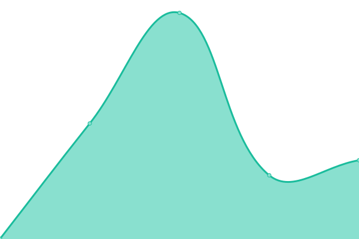

# [📈 Live Status](https://https://iliya5digital.github.io/): <!--live status--> **🟩 All systems operational**

This repository contains the open-source uptime monitor and status page for [iliya5digital](https://https://iliya5digital.github.io/), powered by [Upptime](https://github.com/upptime/upptime).

With [Upptime](https://upptime.js.org), you can get your own unlimited and free uptime monitor and status page, powered entirely by a GitHub repository. We use [Issues](https://github.com/iliya5digital/uptime/issues) as incident reports, [Actions](https://github.com/iliya5digital/uptime/actions) as uptime monitors, and [Pages](https://https://iliya5digital.github.io/) for the status page.

<!--start: status pages-->
<!-- This summary is generated by Upptime (https://github.com/upptime/upptime) -->
<!-- Do not edit this manually, your changes will be overwritten -->
<!-- prettier-ignore -->
| URL | Status | History | Response Time | Uptime |
| --- | ------ | ------- | ------------- | ------ |
|  [FK](https://fk.by) | 🟩 Up | [fk.yml](https://github.com/Iliya5digital/uptime/commits/HEAD/history/fk.yml) | 

 1168ms
     
 | 

<a href="https://https://iliya5digital.github.io//history/fk">100.00%</a>
    

|  [MultiGame](https://multigame.by) | 🟩 Up | [multi-game.yml](https://github.com/Iliya5digital/uptime/commits/HEAD/history/multi-game.yml) | 

 993ms
     
 | 

<a href="https://https://iliya5digital.github.io//history/multi-game">100.00%</a>
    

|  [dcompany](https://dcompany.by) | 🟩 Up | [dcompany.yml](https://github.com/Iliya5digital/uptime/commits/HEAD/history/dcompany.yml) | 

 1311ms
     
 | 

<a href="https://https://iliya5digital.github.io//history/dcompany">100.00%</a>
    

|  [Microsoft](https://microsoft.com) | 🟩 Up | [microsoft.yml](https://github.com/Iliya5digital/uptime/commits/HEAD/history/microsoft.yml) | 

 875ms
     
 | 

<a href="https://https://iliya5digital.github.io//history/microsoft">100.00%</a>
    

|  [newblue](https://www.newbluefx.com) | 🟩 Up | [newblue.yml](https://github.com/Iliya5digital/uptime/commits/HEAD/history/newblue.yml) | 

 599ms
     
 | 

<a href="https://https://iliya5digital.github.io//history/newblue">100.00%</a>
    

|  [dmyt](https://dmyt.ru) | 🟩 Up | [dmyt.yml](https://github.com/Iliya5digital/uptime/commits/HEAD/history/dmyt.yml) | 

 1484ms
     
 | 

<a href="https://https://iliya5digital.github.io//history/dmyt">100.00%</a>
    

|  [mybb](http://mybb.ru) | 🟩 Up | [mybb.yml](https://github.com/Iliya5digital/uptime/commits/HEAD/history/mybb.yml) | 

 643ms
     
 | 

<a href="https://https://iliya5digital.github.io//history/mybb">100.00%</a>
    

|  [21vek](https://21vek.by) | 🟩 Up | [21vek.yml](https://github.com/Iliya5digital/uptime/commits/HEAD/history/21vek.yml) | 

 4395ms
     
 | 

<a href="https://https://iliya5digital.github.io//history/21vek">100.00%</a>
    

<!--end: status pages-->

[**Visit our status website →**](https://https://iliya5digital.github.io/)

## 📄 License

- Powered by: [Upptime](https://github.com/upptime/upptime)
- Code: [MIT](./LICENSE) © [iliya5digital](https://https://iliya5digital.github.io/)
- Data in the `./history` directory: [Open Database License](https://opendatacommons.org/licenses/odbl/1-0/)
