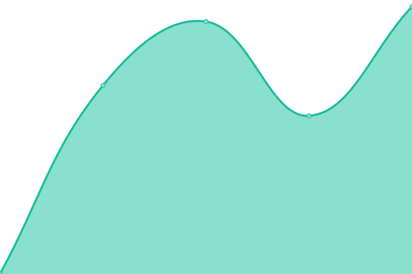
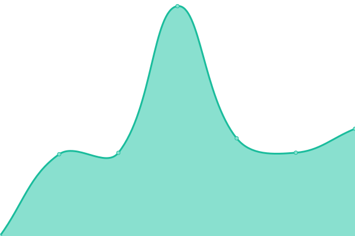
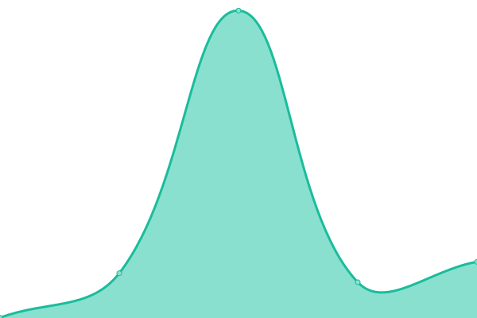

# [📈 Live Status](https://https://iliya5digital.github.io/): <!--live status--> **🟧 Partial outage**

This repository contains the open-source uptime monitor and status page for [iliya5digital](https://https://iliya5digital.github.io/), powered by [Upptime](https://github.com/upptime/upptime).

With [Upptime](https://upptime.js.org), you can get your own unlimited and free uptime monitor and status page, powered entirely by a GitHub repository. We use [Issues](https://github.com/iliya5digital/uptime/issues) as incident reports, [Actions](https://github.com/iliya5digital/uptime/actions) as uptime monitors, and [Pages](https://https://iliya5digital.github.io/) for the status page.

<!--start: status pages-->
<!-- This summary is generated by Upptime (https://github.com/upptime/upptime) -->
<!-- Do not edit this manually, your changes will be overwritten -->
<!-- prettier-ignore -->
| URL | Status | History | Response Time | Uptime |
| --- | ------ | ------- | ------------- | ------ |
|  [FK](https://fk.by) | 🟩 Up | [fk.yml](https://github.com/Iliya5digital/uptime/commits/HEAD/history/fk.yml) | 

 1135ms
     
 | 

<a href="https://https://iliya5digital.github.io//history/fk">100.00%</a>
    

|  [MultiGame](https://multigame.by) | 🟩 Up | [multi-game.yml](https://github.com/Iliya5digital/uptime/commits/HEAD/history/multi-game.yml) | 

 932ms
     
 | 

<a href="https://https://iliya5digital.github.io//history/multi-game">100.00%</a>
    

|  [dcompany](https://dcompany.by) | 🟩 Up | [dcompany.yml](https://github.com/Iliya5digital/uptime/commits/HEAD/history/dcompany.yml) | 

 1239ms
     
 | 

<a href="https://https://iliya5digital.github.io//history/dcompany">100.00%</a>
    

|  [Microsoft](https://microsoft.com) | 🟩 Up | [microsoft.yml](https://github.com/Iliya5digital/uptime/commits/HEAD/history/microsoft.yml) | 

 818ms
     
 | 

<a href="https://https://iliya5digital.github.io//history/microsoft">100.00%</a>
    

|  [newblue](https://www.newbluefx.com) | 🟩 Up | [newblue.yml](https://github.com/Iliya5digital/uptime/commits/HEAD/history/newblue.yml) | 

 614ms
     
 | 

<a href="https://https://iliya5digital.github.io//history/newblue">100.00%</a>
    

|  [dmyt](https://dmyt.ru) | 🟩 Up | [dmyt.yml](https://github.com/Iliya5digital/uptime/commits/HEAD/history/dmyt.yml) | 

 1341ms
     
 | 

<a href="https://https://iliya5digital.github.io//history/dmyt">100.00%</a>
    

|  [mybb](http://mybb.ru) | 🟩 Up | [mybb.yml](https://github.com/Iliya5digital/uptime/commits/HEAD/history/mybb.yml) | 

 588ms
     
 | 

<a href="https://https://iliya5digital.github.io//history/mybb">100.00%</a>
    

|  [21vek](https://21vek.by) | 🟩 Up | [21vek.yml](https://github.com/Iliya5digital/uptime/commits/HEAD/history/21vek.yml) | 

 4046ms
     
 | 

<a href="https://https://iliya5digital.github.io//history/21vek">100.00%</a>
    

|  [ISONCOM](https://isoncom.ru) | 🟩 Up | [isoncom.yml](https://github.com/Iliya5digital/uptime/commits/HEAD/history/isoncom.yml) | 

 3446ms
     
 | 

<a href="https://https://iliya5digital.github.io//history/isoncom">100.00%</a>
    

|  [kunegin](http://kunegin.com) | 🟩 Up | [kunegin.yml](https://github.com/Iliya5digital/uptime/commits/HEAD/history/kunegin.yml) | 

 736ms
     
 | 

<a href="https://https://iliya5digital.github.io//history/kunegin">100.00%</a>
    

|  [directmusic](https://directmusic.me) | 🟩 Up | [directmusic.yml](https://github.com/Iliya5digital/uptime/commits/HEAD/history/directmusic.yml) | 

 524ms
     
 | 

<a href="https://https://iliya5digital.github.io//history/directmusic">100.00%</a>
    

|  [knowyourmobile](https://www.knowyourmobile.com/) | 🟩 Up | [knowyourmobile.yml](https://github.com/Iliya5digital/uptime/commits/HEAD/history/knowyourmobile.yml) | 

 376ms
     
 | 

<a href="https://https://iliya5digital.github.io//history/knowyourmobile">100.00%</a>
    

|  [ohrana UA - охранные системы](https://ohrana.ua/) | 🟩 Up | [ohrana-ua-ohrannye-sistemy.yml](https://github.com/Iliya5digital/uptime/commits/HEAD/history/ohrana-ua-ohrannye-sistemy.yml) | 

 1659ms
     
 | 

<a href="https://https://iliya5digital.github.io//history/ohrana-ua-ohrannye-sistemy">100.00%</a>
    

|  [zaberem](https://zaberem.by) | 🟥 Down | [zaberem.yml](https://github.com/Iliya5digital/uptime/commits/HEAD/history/zaberem.yml) | 

 1209ms
     
 | 

<a href="https://https://iliya5digital.github.io//history/zaberem">21.62%</a>
    

|  [Xiaomi](https://mi.com) | 🟩 Up | [xiaomi.yml](https://github.com/Iliya5digital/uptime/commits/HEAD/history/xiaomi.yml) | 

 2367ms
     
 | 

<a href="https://https://iliya5digital.github.io//history/xiaomi">100.00%</a>
    

|  [wplovers](https://wplovers.pw) | 🟩 Up | [wplovers.yml](https://github.com/Iliya5digital/uptime/commits/HEAD/history/wplovers.yml) | 

 2387ms
     
 | 

<a href="https://https://iliya5digital.github.io//history/wplovers">100.00%</a>
    

|  [WINITPRO](https://winitpro.ru) | 🟩 Up | [winitpro.yml](https://github.com/Iliya5digital/uptime/commits/HEAD/history/winitpro.yml) | 

 1424ms
     
 | 

<a href="https://https://iliya5digital.github.io//history/winitpro">100.00%</a>
    

|  [wdfiles](https://wdfiles.ru) | 🟩 Up | [wdfiles.yml](https://github.com/Iliya5digital/uptime/commits/HEAD/history/wdfiles.yml) | 

 1731ms
     
 | 

<a href="https://https://iliya5digital.github.io//history/wdfiles">100.00%</a>
    

|  [wapinet](https://wapinet.ru) | 🟩 Up | [wapinet.yml](https://github.com/Iliya5digital/uptime/commits/HEAD/history/wapinet.yml) | 

 716ms
     
 | 

<a href="https://https://iliya5digital.github.io//history/wapinet">100.00%</a>
    

|  [wallpaperaccess](https://wallpaperaccess.com/) | 🟥 Down | [wallpaperaccess.yml](https://github.com/Iliya5digital/uptime/commits/HEAD/history/wallpaperaccess.yml) | 

 85ms
     
 | 

<a href="https://https://iliya5digital.github.io//history/wallpaperaccess">0.02%</a>
    

|  [vpngate](https://www.vpngate.net) | 🟩 Up | [vpngate.yml](https://github.com/Iliya5digital/uptime/commits/HEAD/history/vpngate.yml) | 

 1907ms
     
 | 

<a href="https://https://iliya5digital.github.io//history/vpngate">100.00%</a>
    

|  [ugonanet](https://www.ugona.net) | 🟩 Up | [ugonanet.yml](https://github.com/Iliya5digital/uptime/commits/HEAD/history/ugonanet.yml) | 

 1065ms
     
 | 

<a href="https://https://iliya5digital.github.io//history/ugonanet">100.00%</a>
    

|  [text-host](http://text-host.ru) | 🟩 Up | [text-host.yml](https://github.com/Iliya5digital/uptime/commits/HEAD/history/text-host.yml) | 

 1451ms
     
 | 

<a href="https://https://iliya5digital.github.io//history/text-host">100.00%</a>
    

|  [statonline](https://statonline.ru/) | 🟥 Down | [statonline.yml](https://github.com/Iliya5digital/uptime/commits/HEAD/history/statonline.yml) | 

 1226ms
     
 | 

<a href="https://https://iliya5digital.github.io//history/statonline">0.13%</a>
    

|  [spaces](https://spcs.mobi) | 🟩 Up | [spaces.yml](https://github.com/Iliya5digital/uptime/commits/HEAD/history/spaces.yml) | 

 880ms
     
 | 

<a href="https://https://iliya5digital.github.io//history/spaces">100.00%</a>
    

|  [shopby](https://shop.by) | 🟩 Up | [shopby.yml](https://github.com/Iliya5digital/uptime/commits/HEAD/history/shopby.yml) | 

 2694ms
     
 | 

<a href="https://https://iliya5digital.github.io//history/shopby">100.00%</a>
    

|  [rutracker](https://rutracker.org) | 🟥 Down | [rutracker.yml](https://github.com/Iliya5digital/uptime/commits/HEAD/history/rutracker.yml) | 

 149ms
     
 | 

<a href="https://https://iliya5digital.github.io//history/rutracker">0.01%</a>
    

|  [rutor](http://rutor.info) | 🟩 Up | [rutor.yml](https://github.com/Iliya5digital/uptime/commits/HEAD/history/rutor.yml) | 

 818ms
     
 | 

<a href="https://https://iliya5digital.github.io//history/rutor">100.00%</a>
    

|  [reg](https://www.reg.ru) | 🟩 Up | [reg.yml](https://github.com/Iliya5digital/uptime/commits/HEAD/history/reg.yml) | 

 918ms
     
 | 

<a href="https://https://iliya5digital.github.io//history/reg">100.00%</a>
    

|  [ram](https://ram.by) | 🟩 Up | [ram.yml](https://github.com/Iliya5digital/uptime/commits/HEAD/history/ram.yml) | 

 1517ms
     
 | 

<a href="https://https://iliya5digital.github.io//history/ram">100.00%</a>
    

|  [prossd](https://prossd.ru) | 🟩 Up | [prossd.yml](https://github.com/Iliya5digital/uptime/commits/HEAD/history/prossd.yml) | 

 3346ms
     
 | 

<a href="https://https://iliya5digital.github.io//history/prossd">100.00%</a>
    

|  [prog-top](https://prog-top.net) | 🟩 Up | [prog-top.yml](https://github.com/Iliya5digital/uptime/commits/HEAD/history/prog-top.yml) | 

 5102ms
     
 | 

<a href="https://https://iliya5digital.github.io//history/prog-top">100.00%</a>
    

|  [obmenvsem](https://obmenvsem.org) | 🟩 Up | [obmenvsem.yml](https://github.com/Iliya5digital/uptime/commits/HEAD/history/obmenvsem.yml) | 

 805ms
     
 | 

<a href="https://https://iliya5digital.github.io//history/obmenvsem">100.00%</a>
    

|  [notopening](https://notopening.com) | 🟩 Up | [notopening.yml](https://github.com/Iliya5digital/uptime/commits/HEAD/history/notopening.yml) | 

 450ms
     
 | 

<a href="https://https://iliya5digital.github.io//history/notopening">100.00%</a>
    

|  [notebook31](https://notebook-31.ru) | 🟩 Up | [notebook31.yml](https://github.com/Iliya5digital/uptime/commits/HEAD/history/notebook31.yml) | 

 840ms
     
 | 

<a href="https://https://iliya5digital.github.io//history/notebook31">100.00%</a>
    

|  [mega](https://mega.nz) | 🟩 Up | [mega.yml](https://github.com/Iliya5digital/uptime/commits/HEAD/history/mega.yml) | 

 528ms
     
 | 

<a href="https://https://iliya5digital.github.io//history/mega">100.00%</a>
    

|  [mediafire](https://mediafire.com) | 🟩 Up | [mediafire.yml](https://github.com/Iliya5digital/uptime/commits/HEAD/history/mediafire.yml) | 

 309ms
     
 | 

<a href="https://https://iliya5digital.github.io//history/mediafire">100.00%</a>
    

|  [malwarewatch](https://malwarewatch.org) | 🟩 Up | [malwarewatch.yml](https://github.com/Iliya5digital/uptime/commits/HEAD/history/malwarewatch.yml) | 

 492ms
     
 | 

<a href="https://https://iliya5digital.github.io//history/malwarewatch">100.00%</a>
    

|  [mchost](https://mchost.ru) | 🟩 Up | [mchost.yml](https://github.com/Iliya5digital/uptime/commits/HEAD/history/mchost.yml) | 

 1014ms
     
 | 

<a href="https://https://iliya5digital.github.io//history/mchost">100.00%</a>
    

|  [kichkaz](https://kichkas.biz) | 🟩 Up | [kichkaz.yml](https://github.com/Iliya5digital/uptime/commits/HEAD/history/kichkaz.yml) | 

 1083ms
     
 | 

<a href="https://https://iliya5digital.github.io//history/kichkaz">100.00%</a>
    

|  [ipxe](https://ipxe.org) | 🟩 Up | [ipxe.yml](https://github.com/Iliya5digital/uptime/commits/HEAD/history/ipxe.yml) | 

 538ms
     
 | 

<a href="https://https://iliya5digital.github.io//history/ipxe">100.00%</a>
    

|  [imgdb](https://imgdb.net) | 🟩 Up | [imgdb.yml](https://github.com/Iliya5digital/uptime/commits/HEAD/history/imgdb.yml) | 

 636ms
     
 | 

<a href="https://https://iliya5digital.github.io//history/imgdb">100.00%</a>
    

|  [archive](https://archive.org) | 🟩 Up | [archive.yml](https://github.com/Iliya5digital/uptime/commits/HEAD/history/archive.yml) | 

 496ms
     
 | 

<a href="https://https://iliya5digital.github.io//history/archive">100.00%</a>
    

|  [HYPERPC](https://hyperpc.ru) | 🟩 Up | [hyperpc.yml](https://github.com/Iliya5digital/uptime/commits/HEAD/history/hyperpc.yml) | 

 1078ms
     
 | 

<a href="https://https://iliya5digital.github.io//history/hyperpc">100.00%</a>
    

|  [hostfly](https://www.hostfly.by) | 🟩 Up | [hostfly.yml](https://github.com/Iliya5digital/uptime/commits/HEAD/history/hostfly.yml) | 

 1263ms
     
 | 

<a href="https://https://iliya5digital.github.io//history/hostfly">100.00%</a>
    

|  [hosterby](https://hoster.by) | 🟩 Up | [hosterby.yml](https://github.com/Iliya5digital/uptime/commits/HEAD/history/hosterby.yml) | 

 13788ms
     
 | 

<a href="https://https://iliya5digital.github.io//history/hosterby">100.00%</a>
    

|  [helpwifi](https://help-wifi.com) | 🟩 Up | [helpwifi.yml](https://github.com/Iliya5digital/uptime/commits/HEAD/history/helpwifi.yml) | 

 3697ms
     
 | 

<a href="https://https://iliya5digital.github.io//history/helpwifi">100.00%</a>
    

|  [fex](https://fex.net) | 🟩 Up | [fex.yml](https://github.com/Iliya5digital/uptime/commits/HEAD/history/fex.yml) | 

 941ms
     
 | 

<a href="https://https://iliya5digital.github.io//history/fex">100.00%</a>
    

|  [evozi](https://evozi.com) | 🟩 Up | [evozi.yml](https://github.com/Iliya5digital/uptime/commits/HEAD/history/evozi.yml) | 

 1155ms
     
 | 

<a href="https://https://iliya5digital.github.io//history/evozi">100.00%</a>
    

|  [E2](https://e2.by) | 🟩 Up | [e2.yml](https://github.com/Iliya5digital/uptime/commits/HEAD/history/e2.yml) | 

 5829ms
     
 | 

<a href="https://https://iliya5digital.github.io//history/e2">100.00%</a>
    

|  [domaintools](https://www.domaintools.com) | 🟩 Up | [domaintools.yml](https://github.com/Iliya5digital/uptime/commits/HEAD/history/domaintools.yml) | 

 289ms
     
 | 

<a href="https://https://iliya5digital.github.io//history/domaintools">100.00%</a>
    

|  [DataPro](https://datapro.ru) | 🟩 Up | [data-pro.yml](https://github.com/Iliya5digital/uptime/commits/HEAD/history/data-pro.yml) | 

 1709ms
     
 | 

<a href="https://https://iliya5digital.github.io//history/data-pro">100.00%</a>
    

|  [anonfiles](https://anonfiles.com) | 🟩 Up | [anonfiles.yml](https://github.com/Iliya5digital/uptime/commits/HEAD/history/anonfiles.yml) | 

 805ms
     
 | 

<a href="https://https://iliya5digital.github.io//history/anonfiles">100.00%</a>
    

|  [amd shop](https://www.amd.by/) | 🟥 Down | [amd-shop.yml](https://github.com/Iliya5digital/uptime/commits/HEAD/history/amd-shop.yml) | 

 145ms
     
 | 

<a href="https://https://iliya5digital.github.io//history/amd-shop">0.03%</a>
    

|  [adguard](https://adguard.com) | 🟩 Up | [adguard.yml](https://github.com/Iliya5digital/uptime/commits/HEAD/history/adguard.yml) | 

 1225ms
     
 | 

<a href="https://https://iliya5digital.github.io//history/adguard">100.00%</a>
    

|  [5digital](https://5digital.by) | 🟩 Up | [5digital.yml](https://github.com/Iliya5digital/uptime/commits/HEAD/history/5digital.yml) | 

 5471ms
     
 | 

<a href="https://https://iliya5digital.github.io//history/5digital">100.00%</a>
    

|  [4shared](https://4shared.com) | 🟩 Up | [4shared.yml](https://github.com/Iliya5digital/uptime/commits/HEAD/history/4shared.yml) | 

 476ms
     
 | 

<a href="https://https://iliya5digital.github.io//history/4shared">100.00%</a>
    

|  [4pda](https://4pda.to) | 🟩 Up | [4pda.yml](https://github.com/Iliya5digital/uptime/commits/HEAD/history/4pda.yml) | 

 443ms
     
 | 

<a href="https://https://iliya5digital.github.io//history/4pda">100.00%</a>
    

|  [4pc](https://www.4pc.by) | 🟩 Up | [4pc.yml](https://github.com/Iliya5digital/uptime/commits/HEAD/history/4pc.yml) | 

 2026ms
     
 | 

<a href="https://https://iliya5digital.github.io//history/4pc">100.00%</a>
    

<!--end: status pages-->

[**Visit our status website →**](https://https://iliya5digital.github.io/)

## 📄 License

- Powered by: [Upptime](https://github.com/upptime/upptime)
- Code: [MIT](./LICENSE) © [iliya5digital](https://https://iliya5digital.github.io/)
- Data in the `./history` directory: [Open Database License](https://opendatacommons.org/licenses/odbl/1-0/)
